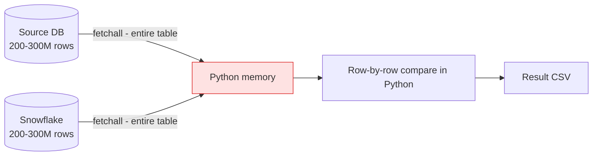
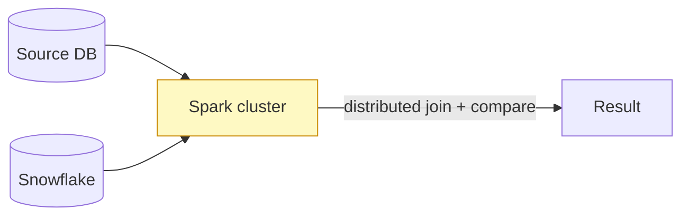
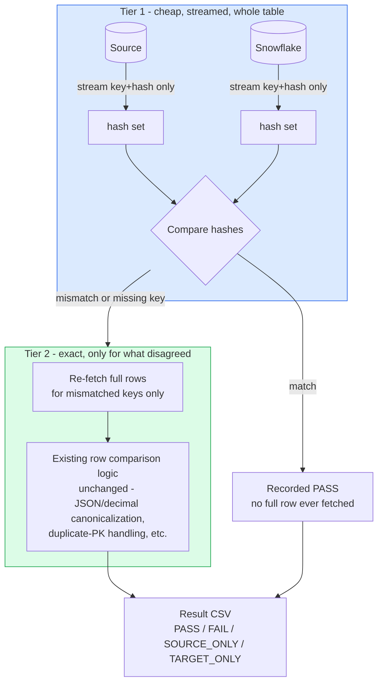

# Why We Chose Streaming/Chunking Over PySpark for Large-Table Validation

**Audience:** manager / non-implementation review. Plain-language companion to the
full technical design in [`README.md`](./README.md) and the audit in
[`../performance-audit-large-tables/README.md`](../performance-audit-large-tables/README.md).

## The problem in one picture

Today the validator pulls a **whole table** from the source and a **whole table**
from Snowflake into memory, then compares them row by row in Python.

That works fine at small/medium scale, but at 200-300M rows both tables plus the
result no longer fit in memory at once — the red box above is the bottleneck.

## Option A: rewrite it in PySpark

Spark's whole value proposition is distributing that same "pull everything, join,
compare" job across a cluster of machines instead of one Python process.

**Why we did not pick this:**

| Concern | Detail |
|---|---|
| New infrastructure | Requires a Spark cluster (EMR/Databricks/etc.) to run, monitor, and pay for — we don't have one for this tool today. |
| Re-implementing correctness logic | All of our existing row-matching rules — duplicate-key handling, composite keys, PK-less row-hash fallback, JSON/hstore canonicalization, NULL handling — would need to be rebuilt in Spark's dataframe API and re-proven correct against the current tool's output. That's the bulk of the validator's actual value, not the "fetch data" part. |
| Four different source types | Postgres, MSSQL, Athena, Redshift each need their own Spark connector/read path tuned separately — same connector-per-source work we already have, plus a cluster on top. |
| Overkill for the actual bottleneck | The real problem is "don't hold 2 full tables + a result in memory at once," not "not enough compute." A cluster doesn't fix that shape of problem any more elegantly than chunking does — it just spreads the same memory problem across more machines. |

## Option B (what we built): stream in chunks, only pull full rows for real mismatches

Instead of adding a cluster, we changed *how* Python reads and compares, using two
ideas that are already standard database techniques:

1. **Streaming/chunked fetch** — read the table in bounded pages (e.g. 50,000 rows
   at a time) instead of one giant `fetchall()`. Already implemented per connector
   (`execute_query_stream` in `Project/db/*.py`).
2. **Hash-and-narrow (Tier 1 → Tier 2)** — compute a lightweight hash per row on
   both sides first (cheap, in SQL), and only pull the **full row content** for
   the rows whose hashes disagree. Rows that hash-match are treated as identical
   and never need their full content to cross the network.

**Why this wins for us:**

- **No new infrastructure** — runs on the same Python process, same connectors, same servers we have today.
- **Reuses all existing correctness logic untouched** — Tier 2 is the *current* comparison code, just fed a much smaller input (only real mismatches, not the whole table). We don't have to re-prove correctness from scratch like we would with Spark.
- **Memory stays bounded** — at any moment we hold "key+hash pairs" (small) or "the mismatch subset" (small for a healthy migration), never two full tables at once.
- **Network traffic drops** — full row content only crosses the wire for rows that actually differ, instead of every row.
- **Graceful worst case** — if a table is genuinely broken and everything mismatches, we fall back to doing what today's tool already does (fetch everything) — never worse than today, only better on the common case.

## One-line summary for the write-up

> We didn't need a distributed compute cluster (PySpark) — the bottleneck was
> "how much data has to sit in memory at once," and we solved that with
> streaming reads plus a cheap hash pre-filter that narrows the expensive,
> exact comparison down to only the rows that actually differ. Same logic,
> same infrastructure, just fed smaller inputs.

## Where to point people for the deep version

- Full architecture options considered, trade-off matrix, and why every alternative
  (key-range partitioning, DB-side hashing as final answer, staging tables) was
  rejected or downgraded: [`README.md`](./README.md) sections D-E.
- What's actually implemented so far vs. still design-only: `README.md` sections
  Q (implemented: grain-check parity) and R (design-only: quality-check parity).
