# Performance Audit — Migration Validator at 200–300M Row Scale

**Status:** Read-only investigation. No code changed. No connector timeout code touched.
**Scope:** Real production path only — `webapp/app.py` → `Project/runner.py` → `Project/main.py` → `Project/db/*.py`.
**Not audited:** `src/validation/*.py`, `data_validator.py`, `count_validator.py`, `validation_executor.py` — dead, moved to `trash/validation/`, no live caller.

---

## A. Execution-flow diagram

```mermaid
flowchart TD
    UI["webapp/app.py<br/>Run Validation button<br/>(app.py:3277 / :3863)"] -->|subprocess.run, timeout=900s default| RUN["Project/runner.py<br/>run_validation()"]
    RUN -->|"python main.py --tables ..."| MAIN["Project/main.py<br/>(one OS process, single-threaded)"]

    MAIN --> LOOP{"for table in tables_to_process<br/>(sequential, one at a time)"}
    LOOP --> SRC["get_database(source) → execute_query()<br/>opens connection, cur.execute(), <b>fetchall()</b><br/>Postgres:44 / MSSQL:54 / Snowflake:48 / Athena:79-84 (1000 rows/page)"]
    LOOP --> TGT["get_database(target=Snowflake) → execute_query()<br/><b>fetchall()</b> → pd.DataFrame<br/>snowflake.py:48-50"]

    SRC --> DF1["source_df: full table in RAM<br/>(main.py:234)"]
    TGT --> DF2["target_df: full table in RAM<br/>(main.py:242)"]

    DF1 --> NORM["canonicalize_frames()<br/>per-cell .map()/.apply() over every shared column<br/>semantic_normalize.py:399-418"]
    DF2 --> NORM

    NORM --> HASH{"PK configured?"}
    HASH -->|no| PYHASH["Python row_hash fallback<br/>DataFrame.apply(axis=1) per row, hashlib per row<br/>main.py:314-323"]
    HASH -->|yes| INDEX["set_index(pk).sort_index()<br/>main.py:332-333"]
    PYHASH --> INDEX

    INDEX --> UNION["sorted(set(src.index) | set(tgt.index), key=str)<br/>builds Python set + full sort of ALL keys<br/>main.py:398-401"]

    UNION --> PKLOOP["pure-Python for pk_val in all_pks:<br/>.loc lookup + row-wise .apply(join) per PK group<br/>main.py:403-445 — O(N) Python-level iteration"]

    PKLOOP --> ROWS["rows: list of dict, 2x columns each<br/>accumulates ALL rows in memory<br/>main.py:402,430,432,445"]

    ROWS --> RESULTDF["pd.DataFrame(rows) — full result materialized again<br/>main.py:447"]

    RESULTDF --> CSV1["result_df.to_csv() — full table, one shot<br/>main.py:449"]
    RESULTDF --> FILTER["failed_df = result_df[status != PASS]<br/>main.py:452"]
    FILTER --> CSV2["failed_df.to_csv()<br/>main.py:455"]

    CSV1 --> SUMMARY["create_summary() → summary CSV<br/>main.py:522"]
    CSV2 --> SUMMARY

    SUMMARY --> BACK["runner.py reads summary CSV + globs result/failed CSVs<br/>back to Streamlit process<br/>runner.py:110-118"]
    BACK --> UI
```

Everything from `SRC`/`TGT` fetch down to `CSV1`/`CSV2` happens **inside one Python process, single-threaded, fully in memory** — there is no chunking, no streaming, no database-side comparison anywhere on this path.

---

## B. Memory-risk table

| Stage | File:Line | Behavior | 200M rows | 300M rows |
|---|---|---|---|---|
| Source fetch | `postgres.py:44`, `mssqlserver.py:54`, `snowflake.py:48` | `cur.fetchall()` — entire result set materialized as a Python list of tuples, then copied into a `pd.DataFrame` | Two in-memory copies momentarily (list + DataFrame) of the full table | Same, larger |
| Athena fetch | `athena.py:64-86` | Every value returned as `VarCharValue` **string**, accumulated into a Python list across 1000-row pages, then one `pd.DataFrame` | List of 200M rows × N string cells, no early type narrowing | Same, larger; string dtype ~2-4x a native numeric/int64 column |
| Target fetch | `snowflake.py:42-50` | Same `fetchall()` pattern | Second full-table copy, concurrently held alongside `source_df` | Same |
| Normalization | `semantic_normalize.py:399-418` | `.map()`/`.apply()` per shared column — pandas builds a new Series per column touched, held alongside the original during the operation | Transient extra column-sized copies, freed per column | Same |
| Row-hash fallback | `main.py:322-323` | `source_df.apply(_hash_row, axis=1)` builds a full-length new Series (`row_hash`) held alongside all existing columns | +1 column, full length | Same |
| Indexing | `main.py:332-333` | `set_index().sort_index()` — pandas builds a sorted copy of the frame | Second full-frame copy while old one still referenced until GC | Same |
| PK union | `main.py:398-401` | `set(...) | set(...)` then `sorted(..., key=str)` — a Python `set` of up to 2×N keys, each boxed as a Python object (not vectorized), then a full sort with a `str()` call per comparison | Set of ~200–400M Python objects — this alone can be tens of GB | Worse |
| Row-level result accumulation | `main.py:402,408-445` | `rows` is a Python `list[dict]`; each dict has `2 + 2×len(display_cols)` (+ transform columns) fields, one dict **per unique PK**, all held until the loop finishes | List of 200M dicts — each dict has real per-field Python object overhead (~100s of bytes each even for small tables); this is typically the single largest memory consumer in the whole pipeline | Worse — likely the first OOM point |
| Result DataFrame | `main.py:447` | `pd.DataFrame(rows)` — converts the entire `list[dict]` into a new DataFrame; both the list and the DataFrame exist simultaneously until `rows` is GC'd | Full duplication at the worst possible moment (peak memory = list + DataFrame together) | Worse |
| CSV write | `main.py:449,455` | `to_csv()` on the full `result_df` and again on `failed_df` (itself a **copy** via boolean-mask filtering, not a view) | `result_df` + `failed_df` co-resident | Worse |

**Bottom line:** nothing on this path is chunked. Peak memory is roughly (source table) + (target table) + (row dict list) + (result DataFrame), all resident at the same time for at least part of the run. For a 200–300M row table with any reasonable column count, this is very likely to exceed available RAM on a typical validator host (this was not load-tested here — see §7).

---

## C. Network-transfer-risk table

| Path | Pushdown today? | Notes |
|---|---|---|
| Postgres/Redshift → Python | Whatever `sourcequery` selects | Filters/projections are whatever the generated SQL specifies (`sourcequery`/`targetquery` in the YAML) — the *query itself* can already project only needed columns and apply `source_filter`/`target_filter`. The **connector adds no additional pushdown or limiting** on top of that; it fetches 100% of whatever the query returns, always. |
| MSSQL (SiteLink) → Python | Same as above | Same caveat — `mssqlserver.py:47-59` has no batching. |
| Athena → Python | Same as above | Extra cost: `get_query_results` pages at 1000 rows/call (hard AWS API limit, not tunable) → **~200,000–300,000 sequential HTTP round-trips** for a 200–300M row table (`athena.py:67-84`). This is a latency/throughput bottleneck independent of memory. |
| Snowflake → Python | Same as above | `fetchall()` with no `fetch_pandas_batches()`/Arrow streaming — snowflake-connector-python supports chunked Arrow fetch, but it isn't used (`snowflake.py:48-49`). |
| Whole-row transfer for large-object columns | No special handling | JSON/JSONB/HStore/VARIANT columns are pulled as full text, not sampled or size-capped — a wide JSON blob column at 200M rows multiplies transfer volume. |

No database-side comparison exists anywhere (no CTAS/EXCEPT/MINUS/hash-join pushdown) — 100% of both sides' data always crosses the network into the Python process for every table validated, regardless of size.

---

## D. CPU/performance-risk table

| Operation | File:Line | Complexity | Why it matters at 200–300M rows |
|---|---|---|---|
| `sorted(set(src.index) | set(tgt.index), key=lambda x: str(x))` | `main.py:398-401` | O(N log N), but with a Python-level `str()` call and object-boxing per element — not vectorized | This is a pure-Python sort over hundreds of millions of elements; orders of magnitude slower than a vectorized pandas/NumPy sort |
| `for pk_val in all_pks: ...` | `main.py:403-445` | O(N) **Python-level** loop, each iteration doing a `.loc[]` lookup + `DataFrame.apply(axis=1, ...)` on the PK's row-group | Row-wise `.apply` and a Python `for` loop are both known pandas anti-patterns at scale — this is interpreter-loop-bound, not C-loop-bound. This is very likely the single worst CPU bottleneck in the whole pipeline. |
| Row-hash fallback | `main.py:314-323` | O(N), one Python function call + `hashlib.new()` per row | Only triggered when no PK is configured, but when it is, it's a full-table Python `.apply(axis=1)` |
| `canonicalize_frames` numeric-string detection | `semantic_normalize.py:403-404` | O(N) per shared column, `.apply()` with a regex match per cell, run twice (source detect + target detect) before even applying the transform | Runs on **every shared column**, even ones that never need normalization — pure overhead scanning at full row count |
| `_column_looks_semi_structured` | `semantic_normalize.py:343-352` | O(200) per column (sample-based) | Cheap — bounded sample, not a real risk |
| `quality_checks.py` null-rate/distinct/aggregate checks | `quality_checks.py:45-104` | O(N) but vectorized (`isna()`, `nunique()`, `pd.to_numeric().sum()`) | Real C-level pandas ops — comparatively fine at this scale, not a top-5 bottleneck |
| `validate_expected_grain` | `quality_checks.py:140-155` | O(N log N), vectorized `duplicated()` | Fine — vectorized |

---

## E. Top 5 bottlenecks (ranked, with exact references)

1. **Full in-memory `fetchall()` on every connector, both sides, every table** — [`Project/db/postgres.py:44`](../../Project/db/postgres.py#L44), [`Project/db/mssqlserver.py:54`](../../Project/db/mssqlserver.py#L54), [`Project/db/snowflake.py:48`](../../Project/db/snowflake.py#L48), [`Project/db/athena.py:79-86`](../../Project/db/athena.py#L79-L86). No chunking anywhere in the connector layer. This is the root cause everything downstream inherits — every other risk in this report exists because the full table is already in memory by the time it reaches comparison logic.
2. **Python-level PK union + sort + row-by-row comparison loop** — [`Project/main.py:398-445`](../../Project/main.py#L398-L445). A pure-Python `for` loop with `.loc` + `.apply(axis=1)` per unique key, over up to 300M keys. This is CPU-bound in the interpreter, not in pandas/NumPy C code, and is very likely the slowest single stage in the pipeline.
3. **Row-dict accumulation + full `pd.DataFrame(rows)` materialization** — [`Project/main.py:402-447`](../../Project/main.py#L402-L447). A `list[dict]` sized to the full row count, immediately re-materialized into a second full-size DataFrame — the moment of peak memory usage in the whole run.
4. **Athena pagination hard-capped at 1000 rows/call** — [`Project/db/athena.py:61-84`](../../Project/db/athena.py#L61-L84). For 200–300M Athena rows this is 200,000–300,000 sequential API calls; this is an AWS API limit, not something the code chose, but it means Athena tables are categorically worse than the other three connectors at this scale regardless of any Python-side fix.
5. **`subprocess.run(..., timeout=900)` default with no partial-result recovery in the UI** — [`Project/runner.py:54,82-84`](../../Project/runner.py#L54-L84), caught in [`webapp/app.py:3277-3280`](../../webapp/app.py#L3277-L3280). A 200–300M row table plausibly runs past 15 minutes; on timeout the subprocess is killed, `run_validation()` raises, and the webapp shows only `"Execution failed to start"` — even though `main.py` may have already written valid per-table CSVs to disk before being killed (see §6).

---

## F. Recommended optimization strategy (ordered by impact)

1. **Stream/chunk the fetch on both connectors** (`fetchmany(n)` / Snowflake's `fetch_pandas_batches()` / server-side cursors for Postgres) instead of `fetchall()`. Highest impact — removes the root cause of both the memory and CPU risk, since every downstream stage currently assumes a fully-materialized frame.
2. **Push comparison logic into the database** for large tables — e.g. hash the row on each side in SQL and compare hash sets, or use a set-difference query (`EXCEPT`/`MINUS`-equivalent) instead of pulling both full tables into Python. This is the only change that actually reduces network transfer, not just Python-side memory.
3. **Replace the Python `for pk_val in all_pks` loop** with a vectorized merge (`pd.merge(src, tgt, how="outer", indicator=True)` + vectorized column-wise comparison) — removes the single worst CPU bottleneck without changing what's being compared.
4. **Chunk the CSV write** — write `result_df`/`failed_df` in batches (`to_csv(..., mode="a")` per chunk) instead of building one full-size DataFrame before writing anything.
5. **Raise/parameterize the webapp subprocess timeout for known-large tables**, and have the UI surface whatever CSVs already landed on disk even when the subprocess was killed, instead of discarding the whole result on a timeout exception.
6. **Athena**: no code-side fix removes the 1000-rows/page ceiling (AWS-imposed) — the only lever is CTAS-to-S3 + bulk read instead of `get_query_results`, which is a larger architectural change.

---

## G. What can be optimized safely without changing validation semantics

- Chunked/streaming fetch (item 1) — same rows, same values, same comparison, just not all in memory at once.
- Vectorized merge instead of the Python PK loop (item 3) — same PASS/FAIL/SOURCE_ONLY/TARGET_ONLY semantics, same set of comparisons, different implementation.
- Chunked CSV writes (item 4) — identical file contents, written incrementally.
- Subprocess timeout increase + surfacing partial results already on disk (item 5) — doesn't change what gets validated, only what the UI does when a run is killed.

These are implementation changes, not behavior changes — they preserve every one of the data-quality dimensions (completeness, uniqueness, accuracy, consistency) described in the project's `CLAUDE.md`.

## H. What should NOT be changed

- **The Fivetran-active filter, exclusion logic, and semantic normalization rules** (`canonicalize_frames`, `config/*_exclusions.yaml`) — these encode correctness decisions, not performance. Touching them to "make things faster" risks silently changing what counts as a match.
- **Connector timeout constants** (`CONNECT_TIMEOUT_SECONDS`, `STATEMENT_TIMEOUT_SECONDS`, `NETWORK_TIMEOUT_SECONDS` in each `Project/db/*.py`) — explicitly out of scope per this audit's instructions, and this work was already verified against real infrastructure separately.
- **Database-side pushdown query changes must preserve the exact same filter/exclusion semantics on both sides** — per `CLAUDE.md`'s "Consistency" dimension, an asymmetric filter change on only one side of a set-difference query would produce false mismatches indistinguishable from real data-quality bugs.
- **Row-level pass/fail visibility** — any chunking/streaming change must still write every row's status, not just failures; `CLAUDE.md` is explicit that "no failures reported" and "validation didn't run" must never look the same.

---

## Answering the top-level question: can this safely validate 200–300M-row tables today?

**Not reliably, as currently implemented.** The architecture holds full source and target tables, plus at least one and often two more full-size intermediate structures (row-dict list, result DataFrame), in a single process's memory at once, with a pure-Python O(N) comparison loop in the hottest path. This is a "will fit in memory and finish in reasonable time for tables up to roughly the tens-of-millions range" design that was not built for hundreds-of-millions-row tables. Nothing here was load-tested as part of this audit (item flagged as **theoretical concern, not measured**) — the memory/CPU claims are structural (code-shape) observations, not benchmarked numbers, and should be validated with an actual 200M+ row dry run before being treated as fact by the team.

---

*Audit performed 2026-09-22 against branch `version1.4`. Read-only — no files modified as part of this investigation.*
